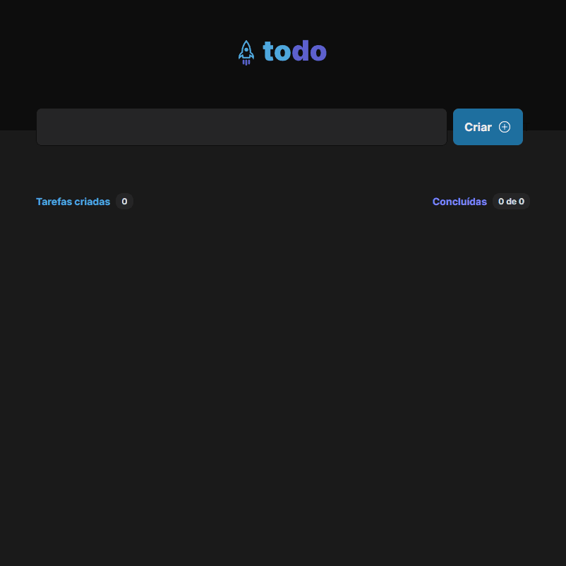

# Todo List Ignite Rocketseat

## Tabela do Conteudo

<ul>
<li><a href="#como-usar">Como usar</li>
<li><a href="#sobre">Sobre</a></li>
<li><a href="#status">Status</a></li>
<li><a href="#objetivo">Objetivo</a></li>
<li><a href="#curiosidade">Curiosidade</a></li>
<li><a href="#tenologias">Tecnologias</a></li>
<li><a href="#acessando-o-site">Acessando o site do projeto</a></li>
</ul>

## Como usar

Para rodar o projeto em sua máquina você deve seguir os passos abaixo:

git clone https://github.com/Lucaszanin/todoList-ignite

cd Todo_list 

npm i 

npm run dev 

## Sobre

O Projeto foi proposto como desafio inicial da trilha de React do curso Ignite da Rocketseat.

Nesse desafio, foi desenvolvido uma aplicação de controle de tarefas no estilo **to-do list**, que contém as seguintes funcionalidades:

- Adicionar uma nova tarefa
- Marcar e desmarcar uma tarefa como concluída
- Remover uma tarefa da listagem
- Mostrar o progresso de conclusão das tarefas

## Status

Projeto Todo List concluido 🎯

## Objetivo

O principal intuito do projeto foi aplicar os conhecimentos do primeiro módulo do curso, utilizando , componentização ,imutabilidade do estado, propriedades de componentes ,tipagem, e estados no React.

Alguns conceitos utilizados no projeto:

Responsividade;
Ciclos de Vida;
Componentização;
Hooks;

## Tecnologias

<ul>
<li>React</li>
<li>CSS</li>
<li>JAVSCRIPT</li>
<li>GIT</li>
<li>Typescript</li>
<li>Vite</li>
<li>Phospor Icons</li>
</ul>

## Acessando o site do projeto

Para acessar o site do projeto Todo Listo, por favor use este link : <a href="https://todo-list-gamma-teal.vercel.app" target="_blank"> Todo List</a>
